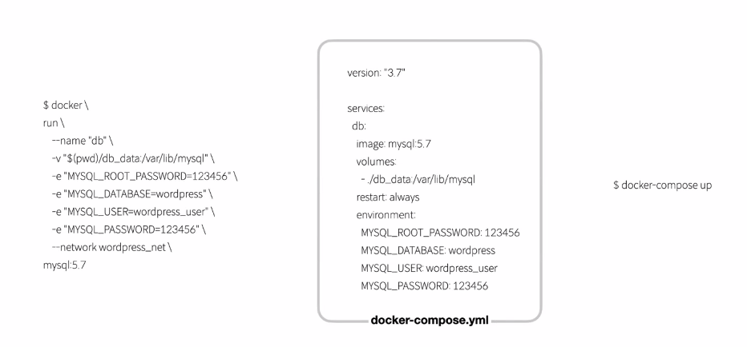

## log (로그확인하기)

 docker logs --tail 10 sweet_williamson
 docker logs -f -t [container]

>
2023/04/12 00:18:30 [notice] 1#1: start worker process 41
2023/04/12 00:18:30 [notice] 1#1: start worker process 42
....

## 도커의 이미지란?
1) 도커의 이미지 구조


레이어 위에 계속 쌓여가는 형태인걸로 확인할수 있다.
단 왼쪽에 있는 이미지 layer는 읽기전용이지만 container layer는 R/w가 가능하다.

## 이미지 레이어 확인하는 방법
docker image inspect mysql ...

## dockerfile 없이 이미지 생성

```
docker run -it --name ~~ ubuntu


echo "hello ubuntu" > my_file
```
contorl + p, q
```
docker commit -a hwkim -m "Add my_file" my-ubuntu my-ubuntu:v1.0.0
```
>결과 (docker images)
```
REPOSITORY   TAG       IMAGE ID       CREATED          SIZE
my-ubuntu    v1.0.0    ec3940a33736   49 seconds ago   77.8MB
```
```
docker image inspect my-ubuntu:v1.0.0
```
"Layers" 안에 생겨있음(1개 더 생겨있음)
"Layers": [
                "sha256:b93c1bd012ab8fda60f5b4f5906bf244586e0e3292d84571d3abb56472248466",
                "sha256:84face56cb3677679ff21ee1d98b8c3923684e0269191436401663bee1dff6d7"
]

원본은
```
 "Layers": [
                "sha256:b93c1bd012ab8fda60f5b4f5906bf244586e0e3292d84571d3abb56472248466"
            ]
```

## Dockerfile 이용한 이미지 생성
Dockerfile은 지시어와 인자값으로 구성되어있음
```
ex)
FROM node:12=alpine
RUN apk add --no-cache python3 g++ make
WORKDIR /app
COPY . .
RUN yarn install --production
CMD ["node","src/index.js"]
```

docker build라는 명령어를 통해서 이미지를 만들수 있음


### 현재 디렉토리를 빌든 컨텍스트로 my-app:v1 이미지 빌드(Dockerfile 이용)
```
docker build -t my-app:v1 ./
```
### -f 옵션을 통해 build할 dockerfile을 지정 (example/MyDockerfile 이용)
```
docker build -t my-app:v1 -f example/MyDockerfile ./
```
### .gitignore와 같이 .dockerignore이 존재함

```
*/temp*
*/*temp*
temp?

*.md
!REDME.md
```

## Dockerfile 문법
>FROM: 어떤베이스이미지를 사용할건지

>LABEL: 이미지의 메타데이터라고 생각하면 되고, 필수로 작성할 필요 없음

>expose: 문서용도로 실제 작동되지는 않음

>CMD: 컨테이너에서 실행될떄 어떤 명령이 수행ㅎ할지 결정

### 이미지 압축파일로 저장 및 불러오기

```
#docker saver -o [OUTPUT-FILE] IMAGE

docker save -o my-ubuntu.tar ubuntu
```

### 불러오기

```
docker load -i my-ubuntu.tar
```

## Docker 실습

1)tensorflow이미지 가져와서 컨테이너 실행 후 디바이스 목록 확인하기
```
docker pull tensorflow/tensorflow
docker run -it --rm tensorflow/tensorflow bash
python


from tensorflow.python.client import device_lib
device_lib.list_local_devices()
```
```
[name: "/device:CPU:0"
device_type: "CPU"
memory_limit: 268435456
locality {
}
incarnation: 12118106093142155928
xla
]
```


2)miniconda3이미지 가져와서 컨테이너 실행 후 pandas,numpy확인하기
```
docker run -i -t continuumio/miniconda3 /bin/bash

conda create -n new python=3.11
base) root@eff8cc02e163:/# conda activate new
(new) root@eff8cc02e163:/#      

(new) root@32b52699848e:/# pip install numpy
Collecting numpy                                                                                                                                                                                                                                                      
  Downloading numpy-1.24.2-cp311-cp311-manylinux_2_17_x86_64.manylinux2014_x86_64.whl (17.3 MB)                                                                                                                                                                       
     ━━━━━━━━━━━━━━━━━━━━━━━━━━━━━━━━━━━━━━━━ 17.3/17.3 MB 9.1 MB/s eta 0:00:00
Installing collected packages: numpy                                                                                                                                                                                                                                  
Successfully installed numpy-1.24.2                                                                                                                                                                                                                                   
WARNING: Running pip as the 'root' user can result in broken permissions and conflicting behaviour with the system package manager. It is recommended to use a virtual environment instead: https://pip.pypa.io/warnings/venv                                         
(new) root@32b52699848e:/# pip install pandas
Collecting pandas                                                                                                                                                                                                                                                     
  Downloading pandas-2.0.0-cp311-cp311-manylinux_2_17_x86_64.manylinux2014_x86_64.whl (12.2 MB)
     ━━━━━━━━━━━━━━━━━━━━━━━━━━━━━━━━━━━━━━━━ 12.2/12.2 MB 8.8 MB/s eta 0:00:00
Collecting python-dateutil>=2.8.2
  Downloading python_dateutil-2.8.2-py2.py3-none-any.whl (247 kB)
     ━━━━━━━━━━━━━━━━━━━━━━━━━━━━━━━━━━━━━━━━ 247.7/247.7 kB 5.2 MB/s eta 0:00:00
Collecting pytz>=2020.1
  Downloading pytz-2023.3-py2.py3-none-any.whl (502 kB)
     ━━━━━━━━━━━━━━━━━━━━━━━━━━━━━━━━━━━━━━━━ 502.3/502.3 kB 5.9 MB/s eta 0:00:00
Collecting tzdata>=2022.1
  Downloading tzdata-2023.3-py2.py3-none-any.whl (341 kB)
     ━━━━━━━━━━━━━━━━━━━━━━━━━━━━━━━━━━━━━━━━ 341.8/341.8 kB 5.7 MB/s eta 0:00:00
Requirement already satisfied: numpy>=1.21.0 in /opt/conda/envs/new/lib/python3.11/site-packages (from pandas) (1.24.2)
Collecting six>=1.5
  Downloading six-1.16.0-py2.py3-none-any.whl (11 kB)
Installing collected packages: pytz, tzdata, six, python-dateutil, pandas
Successfully installed pandas-2.0.0 python-dateutil-2.8.2 pytz-2023.3 six-1.16.0 tzdata-2023.3
WARNING: Running pip as the 'root' user can result in broken permissions and conflicting behaviour with the system package manager. It is recommended to use a virtual environment instead: https://pip.pypa.io/warnings/ven
```

3)2번에서 만든 컨테이너에서 jupyter notebook 실행하기

```

pip install jupyter

jupyter notebook --ip 0.0.0.0 --allow-root

# jupyter notebook
[I 02:50:38.619 NotebookApp] Writing notebook server cookie secret to /root/.local/share/jupyter/runtime/notebook_cookie_secret

  _   _          _      _
 | | | |_ __  __| |__ _| |_ ___
 | |_| | '_ \/ _` / _` |  _/ -_)
  \___/| .__/\__,_\__,_|\__\___|
       |_|
                       
Read the migration plan to Notebook 7 to learn about the new features and the actions to take if you are using extensions.

https://jupyter-notebook.readthedocs.io/en/latest/migrate_to_notebook7.html

Please note that updating to Notebook 7 might break some of your extensions.

[C 02:50:38.756 NotebookApp] Running as root is not recommended. Use --allow-root to bypass.
(base) root@32b52699848e:/# 
````

### 결과


## Dockerfile

* From
```
FROM <image>[:<tag>] [As <name>]


From nginx:latest As ngx

```


* LABEL(메타데이터)
```
LABEL version="1.0.0"
```

* COPY
```
COPY a.txt /some-directory/b.txt
```

* RUN
컨테이너에서 실행하는 명령어

```
RUN apt-get clean && apt-get autoremove -y
```


* CMD
하나의 docker image에서는 하나의 CMD만 실행 가능

```
CMD ["parmeter1","parameter2"] # entrypoint 사용시
CMD python main.py
```

* WORKDIR
어떤 디렉토리에서 수행할것인지 명시
```
WORKDIR /home/demo
```
* EXPOSE
port/protocol지정이 가능하다. port가 publishing되는 것은 아님
```
EXPOSE 8080
```

* ENV
컨테이너 내부에서 지속적으로 사용할 환경변수 저장

```
ENV <key>  <value>

ENV  LANG ko_kr.UTF-8

```


### 단단한 Dockerfile 작성하기
```
FROM ubuntu:20.04
RUN apt-get update
CMD ["echo","hello Ubuntu"]
```

# ubuntu:20.04 베이스로 이미지 만들기

docker build -t my-image:v1.0.0 .

* 확인
docker images | grep my-image


### 실습 python3.x 베이스 이미지 만들기
```
베이스 이미지 python 3.9
LABEL: version, description
RUN : apt-get update, apt-get upgrade -y
RUN : apt-get install python3-pip
WORKDIR: /data/app
```

```
FROM python:3.9
LABEL version=3.9, description="knockknock"
RUN  apt-get update
RUN  apt-get upgrade -y
RUN  apt-get install python3-pip -y
WORKDIR /data/app

```

```
docker build -t python-app:v1 ./

```

```
wsl@BOOK-4H3SDLR4UV:/mnt/c/Users/user/docker-image$ docker images
REPOSITORY                    TAG         IMAGE ID       CREATED          SIZE
python-app                    v1          5316a6d63d2c   25 seconds ago   968MB
```

```
docker run -i -t --name python_test2 python-app:v1
```

```
Python 3.9.16 (main, Mar 23 2023, 17:36:46) 
[GCC 10.2.1 20210110] on linux
Type "help", "copyright", "credits" or "license" for more information.
>>>

>>> import os
>>> os.path.exists("/data/app")
True
```
```
docker run -it -d --name my-cont python-app:v1


root@6e8da08241ab:/data/app# pwd
/data/app


```
### 패키지 설치 동시에 이미지에 넣기
requirements.txt에 이런 내용을 넣는다
```
pandas==2.0.0
```
Dockerfile을 다음과 같이 수정한다.
```
FROM python:3.9
LABEL version=3.9, description="knockknock"
RUN  apt-get update
RUN  apt-get upgrade -y
RUN  apt-get install python3-pip -y

ADD requirements.txt /data/app/

WORKDIR /data/app

RUN pip install -r requirements.txt
```

```
docker build -t python-app:v3 ./
docker run -it -d --name my-cont python-app:v3
docker exec -it my-cont bash
```
## Machinglearning 모델 실행 이미지 만들기

Dockerfile 변경

```
FROM python:3.9
LABEL version=3.9, description="knockknock"
RUN  apt-get update
RUN  apt-get upgrade -y
RUN  apt-get install git -y
RUN  apt-get install vim -y
RUN  apt-get install locales -y
RUN  apt-get install python3-pip -y

ADD requirements.txt /data/app/

WORKDIR /data/app

RUN pip install -r requirements.txt
RUN git config --global user.name "Bluewolf31666"
RUN git config --global user.emial chh6632@naver.com
RUN git clone "https://github.com/Bluewolf31666/deepFM.git"
RUN python3 -m pip install tensorflow
```

Requirements변경

```
pandas
deepctr
scikit-learn
numpy

```


```
docker build -t python-app:v4 -f Dockerfile2 .
docker run -it -d --name my-cont python-app:v4
docker exec -it my-cont bash
```

Setting에서 data위치 바꿔주기
이후
```
python controller.py 
```
```
결과

2/2 - 0s - loss: 0.0768 - mse: 0.0768 - val_loss: 0.1127 - val_mse: 0.1127
Epoch 100/100
2/2 - 0s - loss: 0.0766 - mse: 0.0766 - val_loss: 0.1128 - val_mse: 0.1128
test mean_squared_error 0.0882
      price                                  os  ... cpu_maker  cpu_generation
0     36890  64 bit Windows 11 Operating System  ...       AMD               0
1    131990             Mac OS Operating System  ...     Apple               0
2     74990  64 bit Windows 11 Operating System  ...     Intel              11
3     89990  64 bit Windows 11 Operating System  ...     Intel              12
4     36890  64 bit Windows 11 Operating System  ...       AMD               0
..      ...                                 ...  ...       ...             ...
278   36890  64 bit Windows 11 Operating System  ...       AMD               0
279   99999         Windows 11 Operating System  ...     Intel              12
280  205000  64 bit Windows 11 Operating System  ...     Intel              12
281   67500  64 bit Windows 11 Operating System  ...     Intel              11
282   24540         Windows 11 Operating System  ...     Intel              10

```

## Docker compose

 Docker compose를 사용하기 위해서는, 크게 나눠 아래의 세 가지 순서로 이루어진다.

1 ) 각각의 컨테이너의 Dockerfile를 작성한다(기존에 있는 이미지를 사용하는 경우는 불필요).
2 ) docker-compose.yml를 작성하고, 각각 독립된 컨테이너의 실행 정의를 실시한다(경우에 따라는 구축 정의도 포함).
3 ) "docker-compose up" 커맨드를 실행하여 docker-compose.yml으로 정의한 컨테이너를 개시한다.

 Docker compose는 start, stop, status, 실행 중의 컨테이너의 로그 출력, 약간의 커맨드의 실행이과 같은 기능도 가지고 있다.

docker-compose.yml 파일은 아래와 같이 yaml으로 Docker 컨테이너에 관한 실행 옵션(build 옵션도 포함되어 있는 경우도 있다)를 기재한 파일이 된다.

```
web:
  build: .
  ports:
   - "5000:5000"
  volumes:
   - .:/code
  links:
   - redis
redis:
  image: redis

# yaml의 기재 방법에 대해서는 아래의 링크를 참고하길 바란다.
# https://docs.docker.com/compose/compose-file/

```
* 즉 docker를 실행하는 모든 코드를 미리 코드로 짜두어서 실행할수 있음



1) Project
* Docker compose 에서 다루는 워크스페이스 단위
* 함꼐 관리하는 서비스 컨테이너의 묶음
* 프로젝트 단위로 기본 docker network가 생성됨
* .yml하나가 procject 하나임


2)yml 구성요소
```
version: 

service:
    web:
        build:
        ports:~~~
    databases:
        ~~~

network:

volume:
````


### docker-compose 명령어

```
docker-compose ls #목록확인

```
