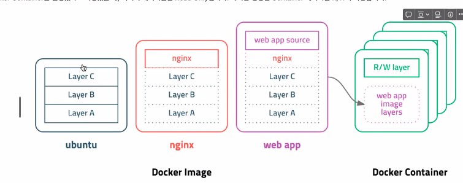
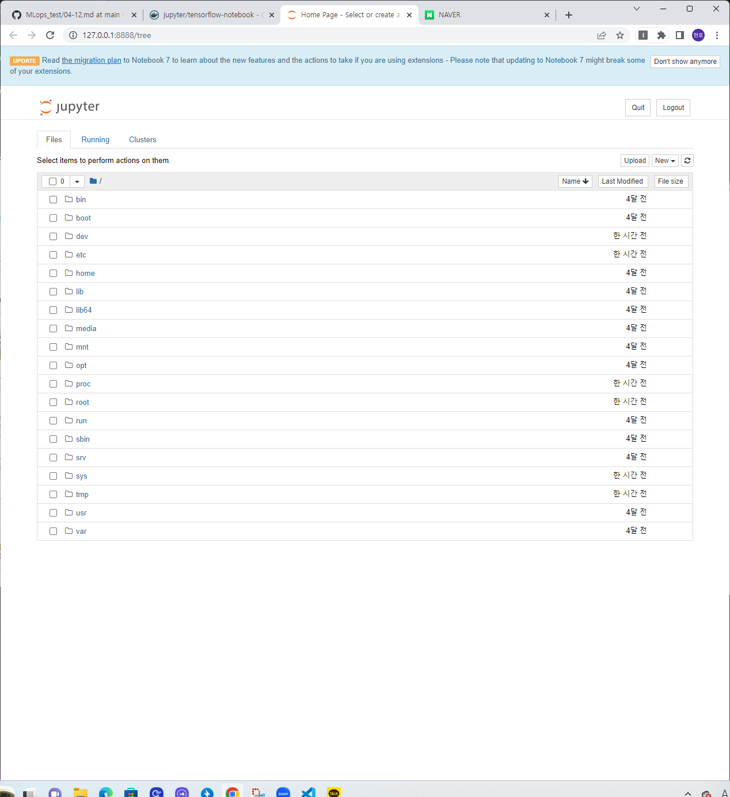

## log (로그확인하기)

 docker logs --tail 10 sweet_williamson
 docker logs -f -t [container]

>
2023/04/12 00:18:30 [notice] 1#1: start worker process 41
2023/04/12 00:18:30 [notice] 1#1: start worker process 42
....

## 도커의 이미지란?
1) 도커의 이미지 구조


레이어 위에 계속 쌓여가는 형태인걸로 확인할수 있다.
단 왼쪽에 있는 이미지 layer는 읽기전용이지만 container layer는 R/w가 가능하다.

## 이미지 레이어 확인하는 방법
docker image inspect mysql ...

## dockerfile 없이 이미지 생성

```
docker run -it --name ~~ ubuntu


echo "hello ubuntu" > my_file
```
contorl + p, q
```
docker commit -a hwkim -m "Add my_file" my-ubuntu my-ubuntu:v1.0.0
```
>결과 (docker images)
```
REPOSITORY   TAG       IMAGE ID       CREATED          SIZE
my-ubuntu    v1.0.0    ec3940a33736   49 seconds ago   77.8MB
```
```
docker image inspect my-ubuntu:v1.0.0
```
"Layers" 안에 생겨있음(1개 더 생겨있음)
"Layers": [
                "sha256:b93c1bd012ab8fda60f5b4f5906bf244586e0e3292d84571d3abb56472248466",
                "sha256:84face56cb3677679ff21ee1d98b8c3923684e0269191436401663bee1dff6d7"
]

원본은
```
 "Layers": [
                "sha256:b93c1bd012ab8fda60f5b4f5906bf244586e0e3292d84571d3abb56472248466"
            ]
```

## Dockerfile 이용한 이미지 생성
Dockerfile은 지시어와 인자값으로 구성되어있음
```
ex)
FROM node:12=alpine
RUN apk add --no-cache python3 g++ make
WORKDIR /app
COPY . .
RUN yarn install --production
CMD ["node","src/index.js"]
```

docker build라는 명령어를 통해서 이미지를 만들수 있음


### 현재 디렉토리를 빌든 컨텍스트로 my-app:v1 이미지 빌드(Dockerfile 이용)
```
docker build -t my-app:v1 ./
```
### -f 옵션을 통해 build할 dockerfile을 지정 (example/MyDockerfile 이용)
```
docker build -t my-app:v1 -f example/MyDockerfile ./
```
### .gitignore와 같이 .dockerignore이 존재함

```
*/temp*
*/*temp*
temp?

*.md
!REDME.md
```

## Dockerfile 문법
>FROM: 어떤베이스이미지를 사용할건지

>LABEL: 이미지의 메타데이터라고 생각하면 되고, 필수로 작성할 필요 없음

>expose: 문서용도로 실제 작동되지는 않음

>CMD: 컨테이너에서 실행될떄 어떤 명령이 수행ㅎ할지 결정

### 이미지 압축파일로 저장 및 불러오기

```
#docker saver -o [OUTPUT-FILE] IMAGE

docker save -o my-ubuntu.tar ubuntu
```

### 불러오기

```
docker load -i my-ubuntu.tar
```

## Docker 실습

1)tensorflow이미지 가져와서 컨테이너 실행 후 디바이스 목록 확인하기
```
docker pull tensorflow/tensorflow
docker run -it --rm tensorflow/tensorflow bash
python


from tensorflow.python.client import device_lib
device_lib.list_local_devices()
```
```
[name: "/device:CPU:0"
device_type: "CPU"
memory_limit: 268435456
locality {
}
incarnation: 12118106093142155928
xla
]
```


2)miniconda3이미지 가져와서 컨테이너 실행 후 pandas,numpy확인하기
```
docker run -i -t continuumio/miniconda3 /bin/bash

conda create -n new python=3.11
base) root@eff8cc02e163:/# conda activate new
(new) root@eff8cc02e163:/#      

(new) root@32b52699848e:/# pip install numpy
Collecting numpy                                                                                                                                                                                                                                                      
  Downloading numpy-1.24.2-cp311-cp311-manylinux_2_17_x86_64.manylinux2014_x86_64.whl (17.3 MB)                                                                                                                                                                       
     ━━━━━━━━━━━━━━━━━━━━━━━━━━━━━━━━━━━━━━━━ 17.3/17.3 MB 9.1 MB/s eta 0:00:00
Installing collected packages: numpy                                                                                                                                                                                                                                  
Successfully installed numpy-1.24.2                                                                                                                                                                                                                                   
WARNING: Running pip as the 'root' user can result in broken permissions and conflicting behaviour with the system package manager. It is recommended to use a virtual environment instead: https://pip.pypa.io/warnings/venv                                         
(new) root@32b52699848e:/# pip install pandas
Collecting pandas                                                                                                                                                                                                                                                     
  Downloading pandas-2.0.0-cp311-cp311-manylinux_2_17_x86_64.manylinux2014_x86_64.whl (12.2 MB)
     ━━━━━━━━━━━━━━━━━━━━━━━━━━━━━━━━━━━━━━━━ 12.2/12.2 MB 8.8 MB/s eta 0:00:00
Collecting python-dateutil>=2.8.2
  Downloading python_dateutil-2.8.2-py2.py3-none-any.whl (247 kB)
     ━━━━━━━━━━━━━━━━━━━━━━━━━━━━━━━━━━━━━━━━ 247.7/247.7 kB 5.2 MB/s eta 0:00:00
Collecting pytz>=2020.1
  Downloading pytz-2023.3-py2.py3-none-any.whl (502 kB)
     ━━━━━━━━━━━━━━━━━━━━━━━━━━━━━━━━━━━━━━━━ 502.3/502.3 kB 5.9 MB/s eta 0:00:00
Collecting tzdata>=2022.1
  Downloading tzdata-2023.3-py2.py3-none-any.whl (341 kB)
     ━━━━━━━━━━━━━━━━━━━━━━━━━━━━━━━━━━━━━━━━ 341.8/341.8 kB 5.7 MB/s eta 0:00:00
Requirement already satisfied: numpy>=1.21.0 in /opt/conda/envs/new/lib/python3.11/site-packages (from pandas) (1.24.2)
Collecting six>=1.5
  Downloading six-1.16.0-py2.py3-none-any.whl (11 kB)
Installing collected packages: pytz, tzdata, six, python-dateutil, pandas
Successfully installed pandas-2.0.0 python-dateutil-2.8.2 pytz-2023.3 six-1.16.0 tzdata-2023.3
WARNING: Running pip as the 'root' user can result in broken permissions and conflicting behaviour with the system package manager. It is recommended to use a virtual environment instead: https://pip.pypa.io/warnings/ven
```

3)2번에서 만든 컨테이너에서 jupyter notebook 실행하기

```

pip install jupyter

jupyter notebook --ip 0.0.0.0 --allow-root

# jupyter notebook
[I 02:50:38.619 NotebookApp] Writing notebook server cookie secret to /root/.local/share/jupyter/runtime/notebook_cookie_secret

  _   _          _      _
 | | | |_ __  __| |__ _| |_ ___
 | |_| | '_ \/ _` / _` |  _/ -_)
  \___/| .__/\__,_\__,_|\__\___|
       |_|
                       
Read the migration plan to Notebook 7 to learn about the new features and the actions to take if you are using extensions.

https://jupyter-notebook.readthedocs.io/en/latest/migrate_to_notebook7.html

Please note that updating to Notebook 7 might break some of your extensions.

[C 02:50:38.756 NotebookApp] Running as root is not recommended. Use --allow-root to bypass.
(base) root@32b52699848e:/# 
````

### 결과

