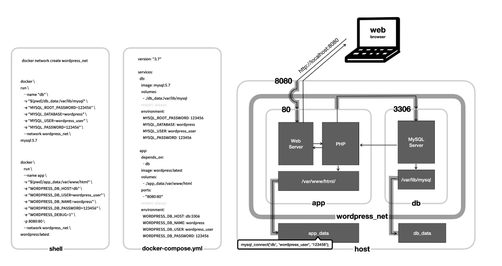

### Docker compose

```
# workpress(mysql)

version: '3.9'

services:
  db:
    platform: linux/amd64 # prevent error m1 mac
    image: mysql:5.7
    volumes:
      - ./db_data:/var/lib/mysql
    ports:
      - 3307:3306
    restart: always
    environment:
      MYSQL_ROOT_PASSWORD: 12345
      MYSQL_DATABASE: wordpress
      MYSQL_USER: wordpress_user
      MYSQL_PASSWORD: 12345

  wordpress:
    depends_on:
      - db
    image: wordpress:latest
    ports:
      - "8080:80"
    restart: always
    environment:
      WORDPRESS_DB_HOST: db:3306
      WORDPRESS_DB_NAME: wordpress
      WORDPRESS_DB_USER: wordpress_user
      WORDPRESS_DB_PASSWORD: 12345

```



```
docker-compose up

[+] Running 3/3
 ✔ Network wsl_default  Created                                                                                                                                      0.0s 
 ✔ Container wsl-db-1   Created                                                                                                                                      0.0s 
 ✔ Container wsl-app-1  Created                                                                                                                                      0.1s

dock-compose down
[+] Running 3/3
 ✔ Container wsl-app-1  Removed                                                                                                                     1.3s 
 ✔ Container wsl-db-1   Removed                                                                                                                     1.1s 
 ✔ Network wsl_default  Removed                                                                                                                     0.2s

```


### 실습 Docker compose from Dockerfile
```
docker compose로 쥬피터 노트북 실행할수 있는 환경으로 만들기
기본포트는 8888

볼륨은 작업경로와 work directory가 같은곳
실행을 entrypoint와 CMD 사용하기


```


```
docker full continuumio/miniconda3
docker run -i -t continuumio/miniconda3 -p 8888/8888 /bin/bash
pip install jupyter
jupyter notebook --ip 0.0.0.0 --allow-root
```

docker-compse.yml파일
```
version: '3'
services:
  notebook:
    container_name: python_notebook
    labels:
      description: Intel Python 2 using Jupyter Notebooks
      name: jupyter notebook
    ports:
      - "8888:8888"
    volumes:
      - /home/wsl:/app
    build: .
```

Dockerfile 내
```
FROM jupyter/scipy-notebook

WORKDIR .

ADD requirements.txt /app/

RUN pip install --upgrade pip
RUN pip install -r /app/requirements.txt

CMD jupyter notebook --port=8888 --no-browser --ip=0.0.0.0 --allow-roott
```

docker-compose up
```
[+] Running 1/0
 ✔ Container python_notebook  Created                                                        0.1s 
Attaching to python_notebook
python_notebook  | [I 02:01:20.040 NotebookApp] Writing notebook server cookie secret to /home/jovyan/.local/share/jupyter/runtime/notebook_cookie_secre
```
## DS 팀과 Engineer팀이 사용할 jupyter notebook환경을 만들어보자

관련 파일은
[위치](jupyter)
에 있습니다

.yml파일
```
version: '3'
  
services:
  jupyter-ds:
    container_name: jupyter-ds
    labels:
      description:  Jupyter Notebooks
      name: jupyter notebook 
    ports:
      - "8888:8888"
    volumes:
      - /home/wsl/jupyter:/app/project-ds
    build: ./project-ds 
  jupyter-engineer:
    container_name: jupyter-engineer
    labels:
      description:  Jupyter Notebooks
      name: jupyter notebook
    ports:
      - "8000:8000"
    volumes:
      - /home/wsl/jupyter:/app/project-engineer
    build: ./project-engineer
    depends_on: 
     - jupyter-ds

```
Dockerfile은 동일


